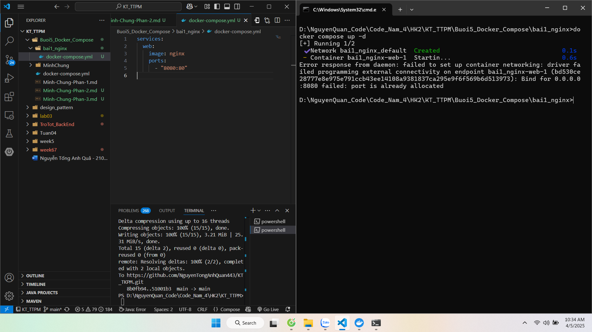
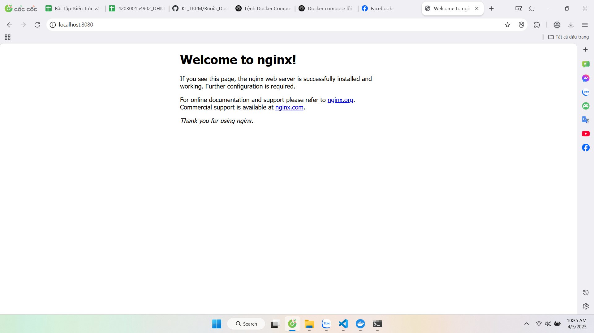
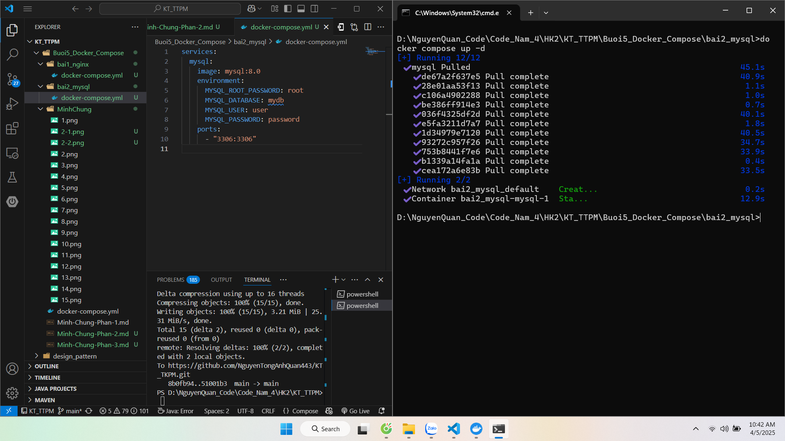
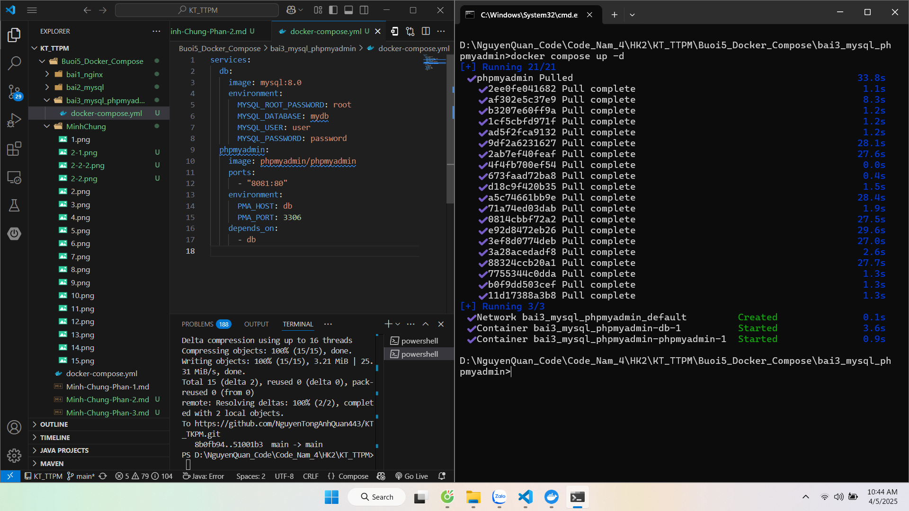
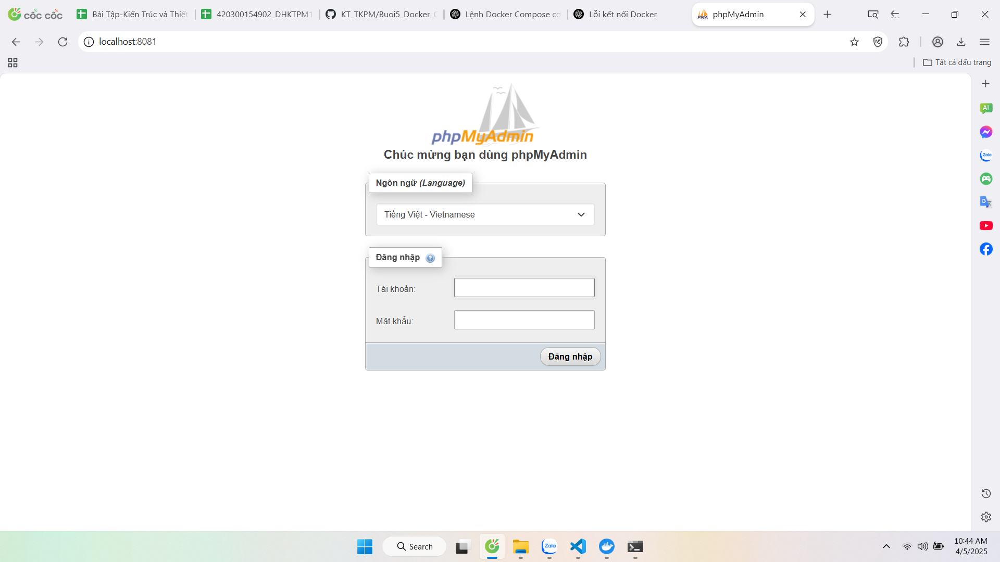
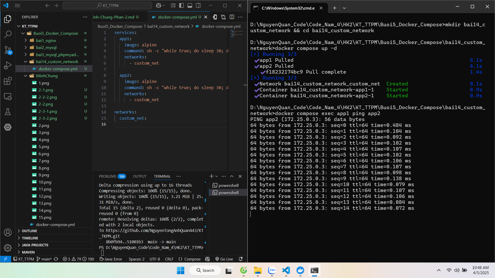

# 🐳 BÀI THỰC HÀNH DOCKER COMPOSE – PHẦN 2

**Họ và tên:** Nguyễn Tống Anh Quân  
**MSSV:** 21006171

---

## 📘 Phần 2: Docker Compose file

---

### ✅ Bài 1: Chạy một container đơn giản với Docker Compose

**Yêu cầu:**
- Tạo một container chạy Nginx bằng Docker Compose.
- Map cổng 8080 của máy host với cổng 80 của container.

**Minh chứng:**

---

### ✅ Bài 2: Chạy MySQL với Docker Compose

**Yêu cầu:**
- Tạo container MySQL phiên bản 8.0.
- Cấu hình username: `user`, password: `password`, database: `mydb`.

**Minh chứng:**

---

### ✅ Bài 3: Kết nối MySQL với PHPMyAdmin

**Yêu cầu:**
- Chạy MySQL và PHPMyAdmin.
- PHPMyAdmin truy cập trên cổng 8081.

**Minh chứng:**

---

### ✅ Bài 4: Chạy ứng dụng Node.js với Docker Compose

**Yêu cầu:**
- Chạy ứng dụng Node.js đơn giản sử dụng Express.

**Minh chứng:**

---

### ✅ Bài 5: Chạy Redis với Docker Compose

**Yêu cầu:**
- Chạy container Redis trên cổng 6379.

**Minh chứng:**

---

### ✅ Bài 6: Chạy WordPress với MySQL

**Yêu cầu:**
- Chạy dịch vụ WordPress với backend là MySQL bằng Docker Compose.

**Minh chứng:**

---

### ✅ Bài 7: Chạy MongoDB với Docker Compose

**Yêu cầu:**
- Chạy MongoDB và Mongo Express để quản lý.

**Minh chứng:**

---

### ✅ Bài 8: Kết nối nhiều dịch vụ với Docker Compose

**Yêu cầu:**
- Chạy Node.js kết nối với MySQL (có thể là hệ thống login hoặc lưu dữ liệu).

**Minh chứng:**

---

### ✅ Bài 9: Chạy ứng dụng Python Flask với Docker Compose

**Yêu cầu:**
- Triển khai ứng dụng Flask đơn giản bằng Docker Compose.

**Minh chứng:**

---

### ✅ Bài 10: Lưu trữ dữ liệu với Docker Volumes

**Yêu cầu:**
- Chạy MySQL và mount volume để đảm bảo dữ liệu không mất khi stop container.

**Minh chứng:**

---

### ✅ Bài 11: Chạy dịch vụ Postgres với Adminer

**Yêu cầu:**
- PostgreSQL: database là `mydb`, user `user`, password `password`.
- Adminer chạy trên cổng 8083.

**Minh chứng:**

---

### ✅ Bài 12: Giám sát container với Prometheus và Grafana

**Yêu cầu:**
- Dùng Docker Compose chạy Prometheus, Grafana, Node Exporter để giám sát container và hệ thống.

**Minh chứng:**

---

### ✅ Bài 13: Chạy ứng dụng React với Nginx

**Yêu cầu:**
- Build ứng dụng React và serve bằng Nginx container.

**Minh chứng:**

---

### ✅ Bài 14: Cấu hình mạng riêng giữa các container

**Yêu cầu:**
- Tạo 2 container có thể ping nhau và truyền dữ liệu thông qua một network riêng biệt do Docker Compose quản lý.

**Minh chứng:**

---

### ✅ Bài 15: Giới hạn tài nguyên cho container

**Yêu cầu:**
- Giới hạn CPU và RAM cho container Redis (ví dụ: 0.5 CPU, 256MB RAM).

**Minh chứng:**

---

**📌 Ghi chú:** Mỗi bài nên kèm theo:
- File `docker-compose.yml`
- Ảnh chụp terminal `docker compose up`, `ps`, `logs`, hoặc giao diện web
- Ghi chú nếu có lỗi khắc phục hoặc kinh nghiệm triển khai

---
