# Họ và tên: Nguyễn Tống Anh Quân
# MSSV: 21006171

# Thực hành Docker Compose

## Phần 1: Một số lệnh Docker Compose cơ bản

### 1. `docker compose version`
> Lệnh kiểm tra phiên bản Docker Compose đã cài đặt.

---

### 2. `docker compose up`
> Khởi động các dịch vụ trong tệp `docker-compose.yml`.

---

### 3. `docker compose up -d`
> Khởi động các dịch vụ ở chế độ nền (detached mode).

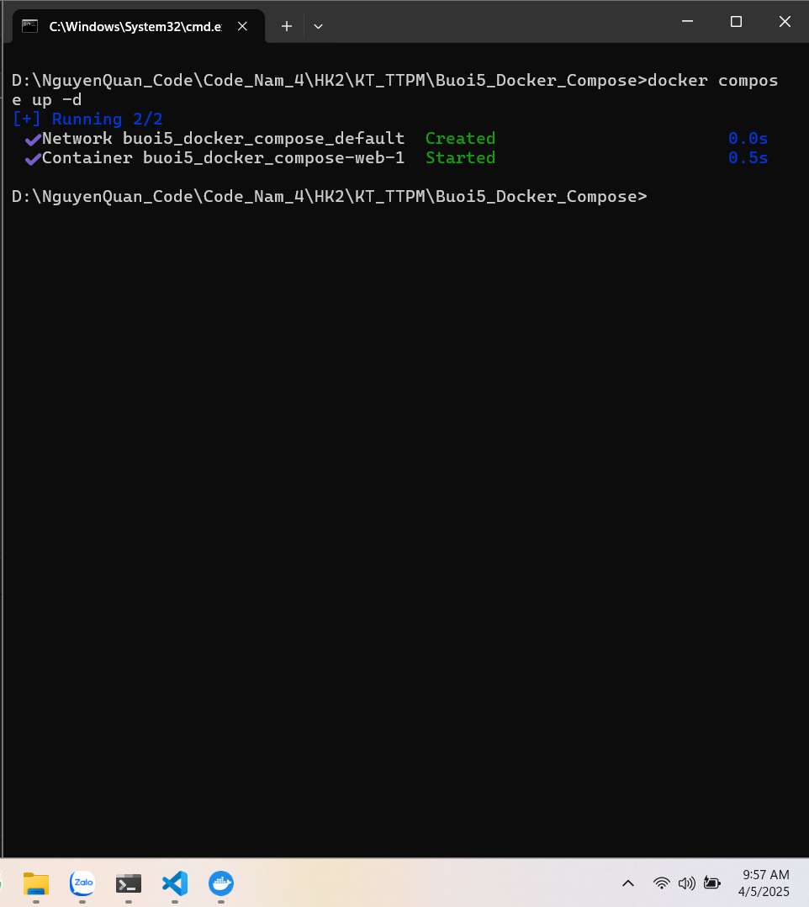

---

### 4. `docker compose ps`
> Kiểm tra trạng thái các container trong Docker Compose.

---

### 5. `docker compose down`
> Dừng và xóa các container, network đã tạo bởi Docker Compose.

---

### 6. `docker compose restart`
> Khởi động lại các container trong Compose.

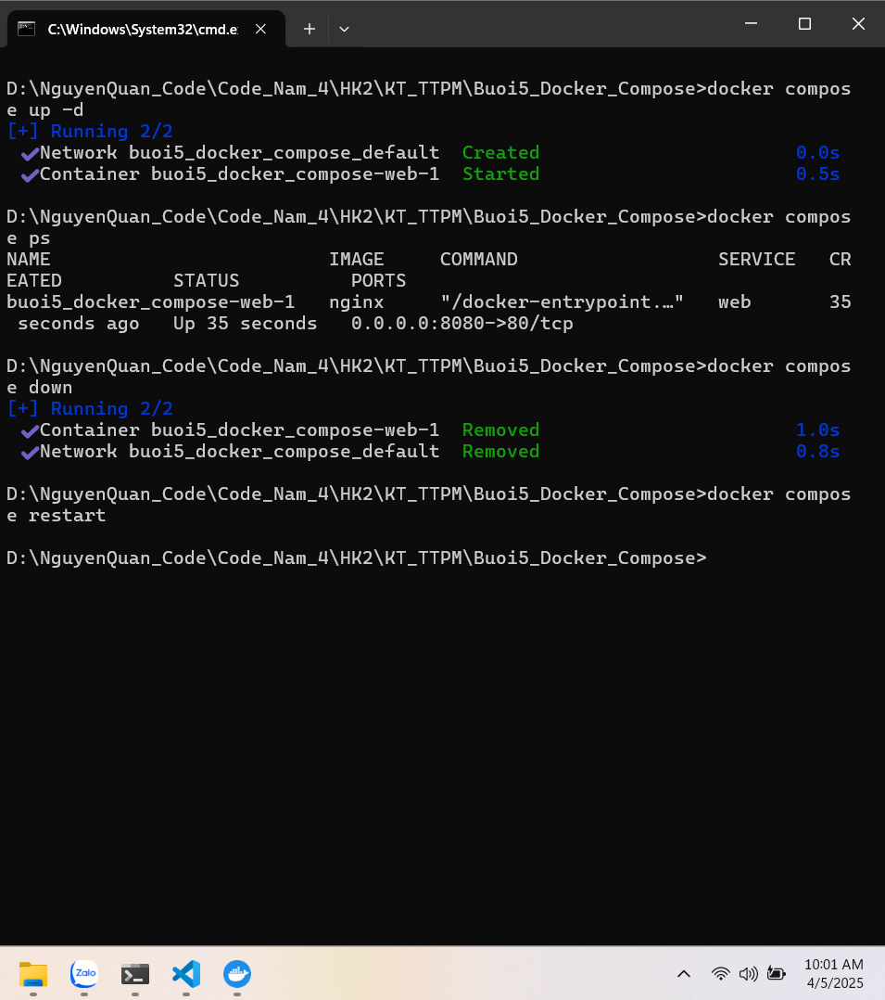

---

### 7. `docker compose logs -f`
> Xem logs trực tiếp từ các container đang chạy.

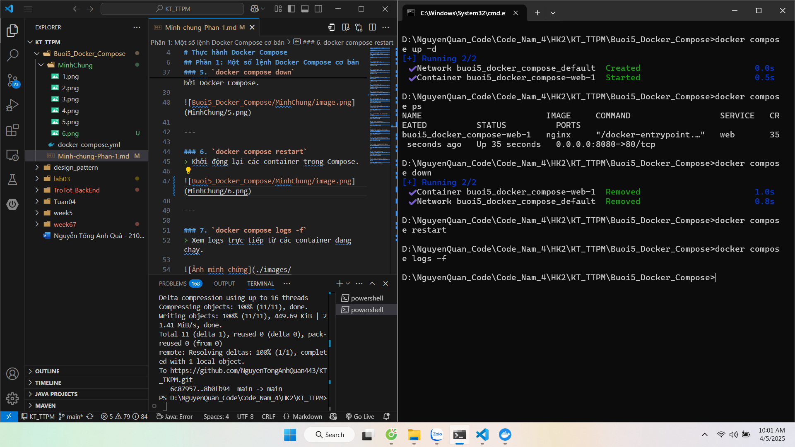

---

### 8. `docker compose build`
> Build lại các image theo định nghĩa trong `docker-compose.yml`.

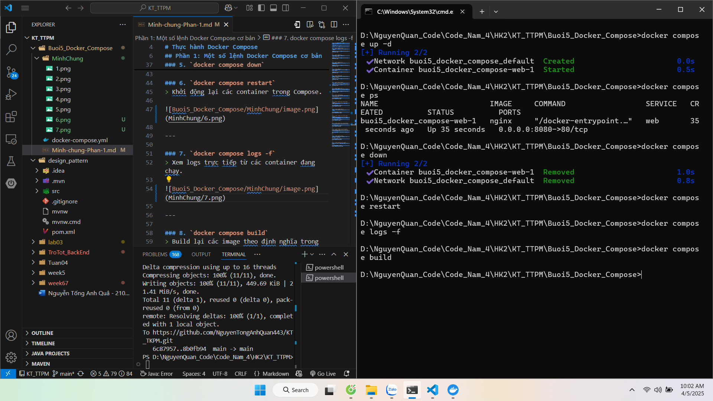

---

### 9. `docker compose exec <service_name> <command>`
> Chạy một lệnh trong container đang chạy (ví dụ: bash, ls, ...).

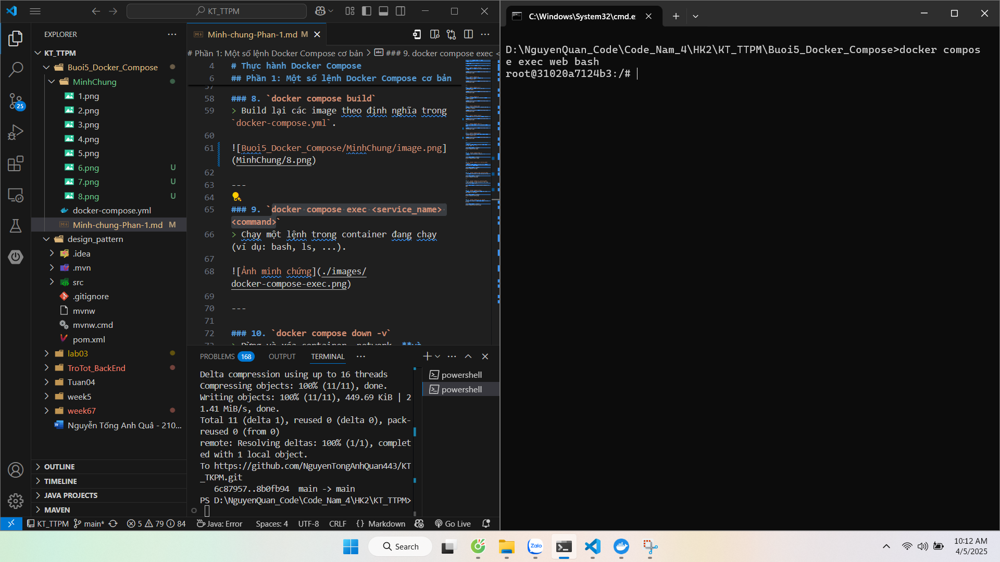

---

### 10. `docker compose down -v`
> Dừng và xóa container, network, **và volume**.

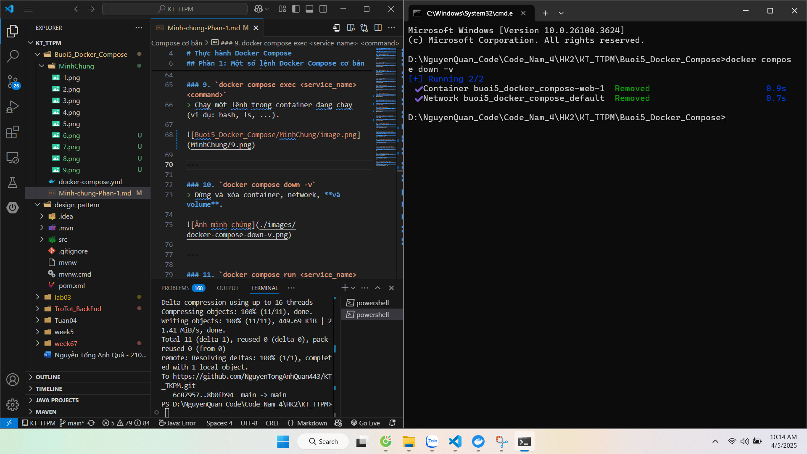

---

### 11. `docker compose run <service_name> <command>`
> Chạy một lệnh trong container mới (không cần container đang chạy).

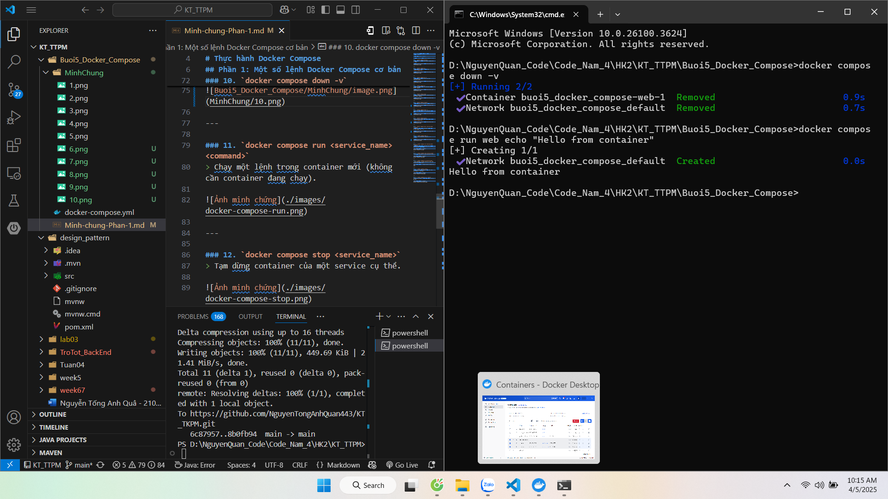

---

### 12. `docker compose stop <service_name>`
> Tạm dừng container của một service cụ thể.

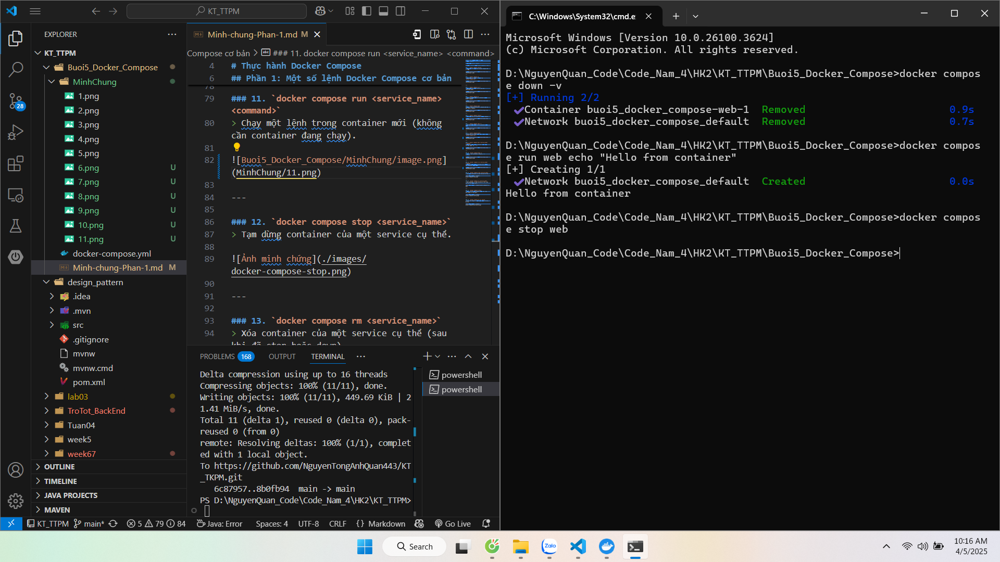

---

### 13. `docker compose rm <service_name>`
> Xóa container của một service cụ thể (sau khi đã stop hoặc down).

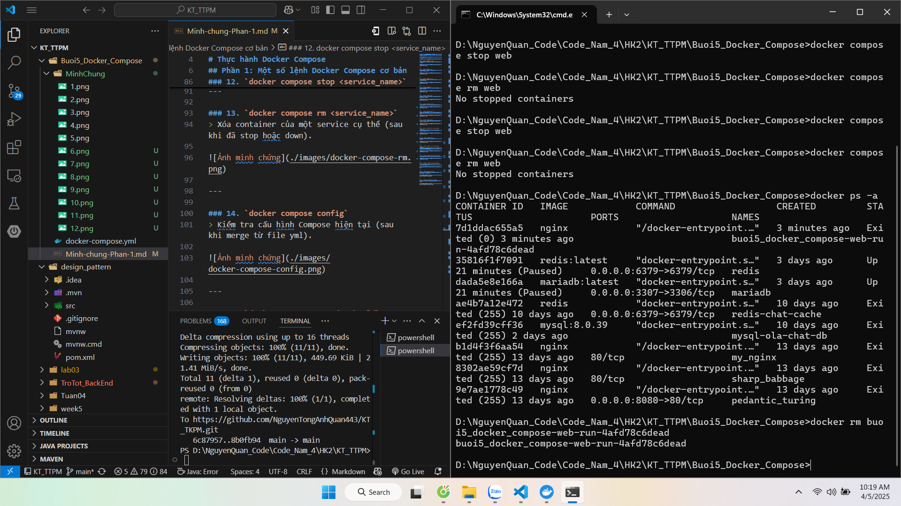

---

### 14. `docker compose config`
> Kiểm tra cấu hình Compose hiện tại (sau khi merge từ file yml).

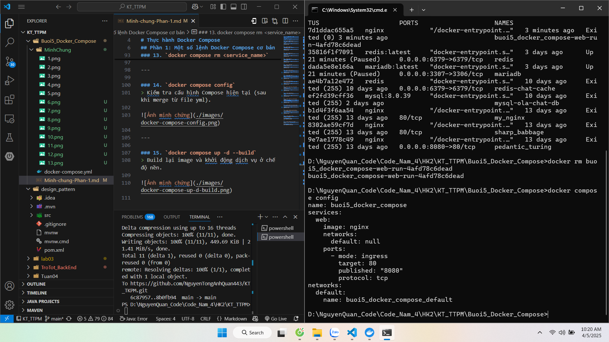

---

### 15. `docker compose up -d --build`
> Build lại image và khởi động dịch vụ ở chế độ nền.

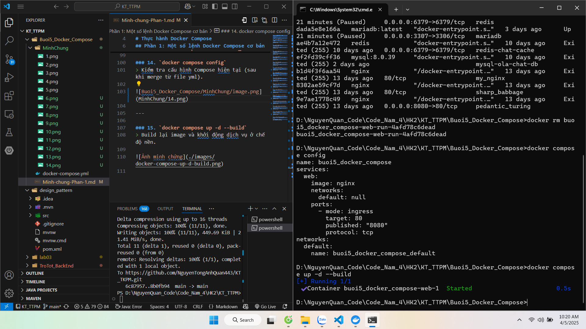
