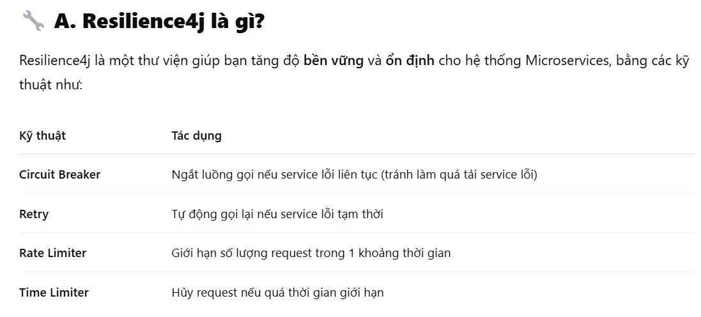

🔌 circuitbreaker – cầu dao ngắt mạch
 - slidingWindowSize: số request để thống kê lỗi
 - minimumNumberOfCalls: số tối thiểu cần gọi để đánh giá lỗi 
 - failureRateThreshold: % lỗi tối đa cho phép (trên tổng số request)
 - waitDurationInOpenState: thời gian mở cầu dao trước khi thử lại

🔁 retry – gọi lại 
- maxAttempts: số lần retry tối đa
- waitDuration: thời gian đợi giữa các lần retry

🚦 ratelimiter – giới hạn tần suất 
- limitForPeriod: tối đa bao nhiêu request mỗi khoảng
- limitRefreshPeriod: khoảng thời gian reset giới hạn (vd 1 giây)

⏱ timelimiter – giới hạn thời gian gọi
- timeoutDuration: thời gian tối đa cho mỗi request